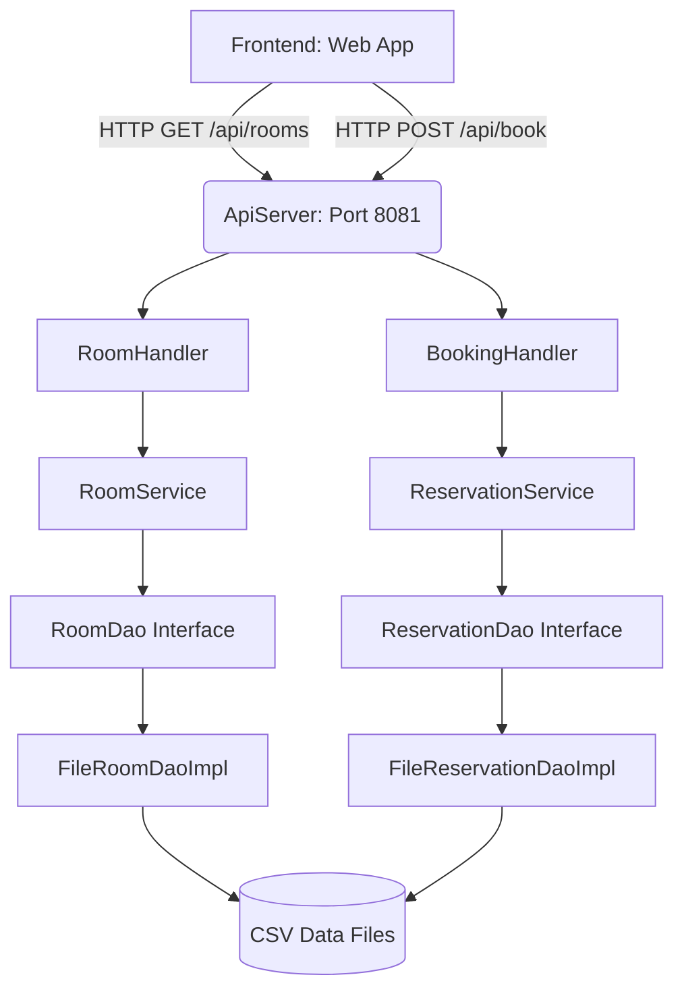

<div align="center">
  
  <br>
  <h1>Aura Hotels - Premium Reservation System</h1>
  <p><strong>A modular, zero-dependency Java Backend paired with a stunning Stitch Design System Frontend.</strong></p>
</div>

<hr>

## 🚀 Overview

**Aura Hotels** is a highly polished, portfolio-ready Hotel Reservation System built as a classic internship project. Unlike typical basic assignments, this project is designed with a **rock-solid Service-Oriented Architecture** and strict separation of concerns, proving an understanding of enterprise-level software design.

The system features a **zero-dependency Java REST API** (running on Java's native `HttpServer`) on the backend, seamlessly communicating with a **Premium HTML/CSS/JS** frontend that perfectly mirrors Google's *Stitch Design System*.

## ✨ Features

- **Strict OOP Architecture:** Employs advanced Java design patterns including Factory, Strategy, and DAO (Data Access Object) to ensure the codebase is modular, scalable, and easy to maintain.
- **Zero-Dependency API:** Avoids heavy frameworks like Spring Boot by implementing a lightweight, native `com.sun.net.httpserver.HttpServer`. Data parsing is handled by a custom `JsonUtil` engine!
- **Premium UI/UX:** The frontend is built using Tailwind CSS mapped to the "Stitch Design System" (Light mode, Inter font, Material Symbols).
- **Dynamic Interactions:** Auto-filtering room searches, beautifully formatted placeholder images, glassmorphism modals, and smooth CSS micro-animations.
- **Robust Persistence Layer:** Features a `FileRoomDaoImpl` for file-based CSV storage, making it instantly executable without requiring a database setup, while maintaining a `JdbcRoomDaoImpl` template for effortless SQL migration.

## 🛠️ Technology Stack

- **Backend:** Java 11+ (Standard Edition)
- **Frontend:** HTML5, Vanilla JavaScript (ES6+), CSS3
- **Styling:** Tailwind CSS (via CDN with custom Stitch Theme Config)
- **Data Storage:** Flat-file CSVs (Easily swappable to JDBC/SQL)

## 🏗️ Architecture



## ⚙️ How to Run Locally

Because this project is built with zero external dependencies, running it is incredibly simple!

### 1. Start the Backend Server
Navigate to the root directory of the project in your terminal and run:
```bash
# Compile the Java classes
javac -sourcepath src/main/java src/main/java/com/hotel/Main.java

# Run the API Server
java -cp src/main/java com.hotel.Main
```
*The server will start on `http://localhost:8081` and automatically seed the database with pseudo rooms!*

### 2. Open the Web Application
No Node.js or `npm` required. Simply double click the `index.html` file in your file browser, or run:
```bash
open ui/index.html
```

## 📸 Screenshots

*(You can place screenshots of your running application here!)*

---
*Created by Rajveer Singh for the CodeAlpha Internship.*
